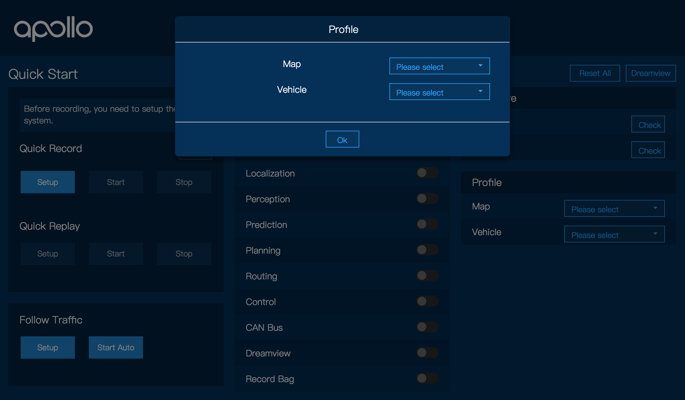
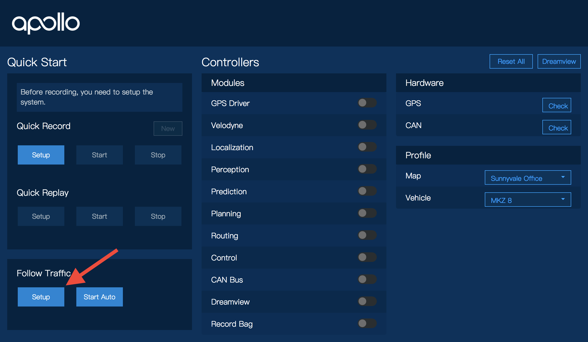
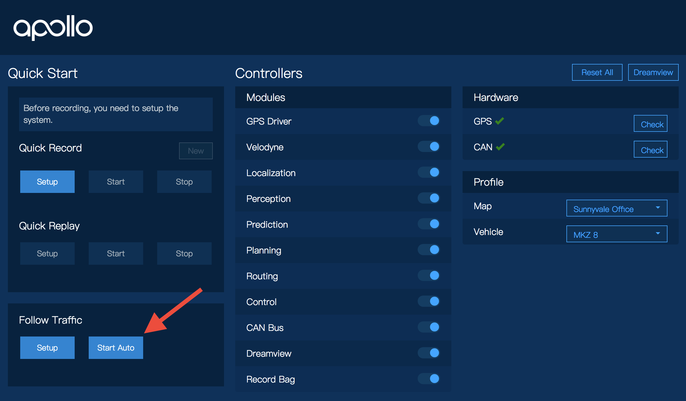

# Apollo 1.5 快速入门指南

这个快速入门指南专注于Apollo 1.5新功能的介绍。对于Apollo的一般概念，请参考 [Apollo 1.0 快速入门指南](https://github.com/ApolloAuto/apollo/blob/master/docs/quickstart/apollo_1_0_quick_start_cn.md)和[Apollo软件安装指南](https://github.com/ApolloAuto/apollo/blob/master/docs/quickstart/apollo_software_installation_guide_cn.md)。

# 上车测试

1. 上车测试，请确认你已经调试了LiDAR与GNSS/INS之间的外部参数。关于传感器标定，请参考[Apollo 1.5 LiDAR calibration guide](https://github.com/ApolloAuto/apollo/blob/master/docs/quickstart/apollo_1_5_lidar_calibration_guide_cn.md)。

2. 启动发布的环境的Docker镜像

3. 启动HMI

    打开浏览器（譬如Chrome）然后在地址栏输入**localhost:8887**来开始Apollo的HMI。

    
 
4. 选择车辆和地图

    单击右上角下拉菜单选择车辆和地图。这个列表是在[HMI config file](https://raw.githubusercontent.com/ApolloAuto/apollo/master/modules/hmi/conf/config.pb.txt)中定义的。

    *注意：你也可以在HMI的右侧界面来更改个人配置。只要记得点击右上角的“Reset All”来重启系统就好*

     

5. 启动所有模块

    

6. 谨慎启动自动驾驶模式

    确定硬件已经齐备，所有模块已经打开并且汽车状态良好，可以安全进入自动模式自动跟车到达目的地。

    