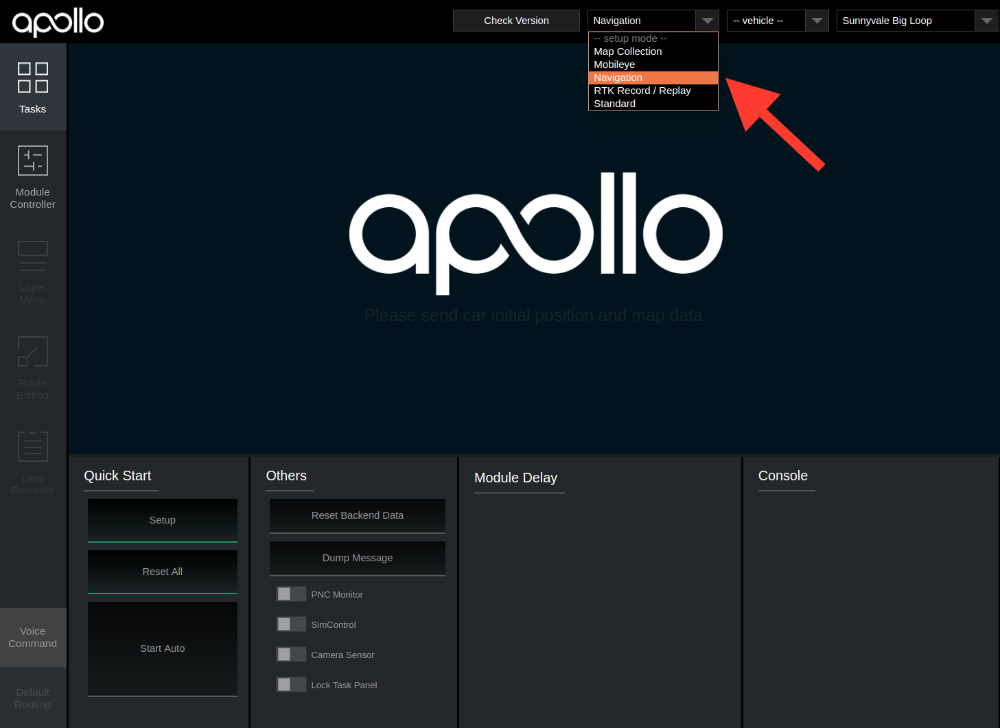

# Apollo 3.0 快速入门指南

该指南是帮助使用者在车辆上安装和启动Apollo 3.0软硬件套件的用户手册。

这个快速入门指南专注于Apollo 3.0新功能的介绍。对于Apollo的通用概念，请参考[Apollo 1.0 快速入门指南](https://github.com/ApolloAuto/apollo/blob/master/docs/quickstart/apollo_1_0_quick_start_cn.md)。

## 内容
- [车辆校准指南](#车辆校准指南)
- [硬件和软件安装](#硬件和软件安装)
- [DreamView的使用](#硬件和软件安装)
- [上车测试](#上车测试)

## 车辆校准指南
在进行车辆测试前必须确保已经校准了所有的传感器，关于传感器校准，请参考[Apollo 2.0 传感器标定方法使用指南](https://github.com/ApolloAuto/apollo/blob/master/docs/quickstart/apollo_2_0_sensor_calibration_guide_cn.md)。

## 硬件和软件安装
请参考[Apollo 3.0 硬件与系统安装指南](https://github.com/ApolloAuto/apollo/blob/master/docs/quickstart/apollo_3_0_hardware_system_installation_guide_cn.md)获取安装硬件组件的步骤，参考[Apollo软件安装指南](https://github.com/ApolloAuto/apollo/blob/master/docs/quickstart/apollo_software_installation_guide_cn.md)获取软件安装步骤。

## DreamView的使用
关于DreamView使用时的相关问题请参考[DreamView用法介绍](https://github.com/ApolloAuto/apollo/blob/master/docs/specs/dreamview_usage_table_cn.md)。

## 上车测试
1. 将一个外部磁盘驱动器接入主机任一可用USB接口。
2. 首先启动车辆，然后启动主机。
3. 启动发布版本的Docker容器。
4. 启动DreamView。

   打开浏览器（譬如Chrome）然后在地址栏输入 http://localhost:8888
   
   
   
5. 选择模式、车辆和地图。

   
   
   附注：在进行任何测试前会要求使用者设置参数。点击下拉列表并选择想要使用的导航模式，高清地图和车辆。该列表数据在[HMI config file](https://raw.githubusercontent.com/ApolloAuto/apollo/master/modules/dreamview/conf/hmi.conf)中定义。
   
   附注：允许使用者在HMI的右侧面板中更改参数，但是需要点击右上角的Reset All按钮重启该系统以使参数生效。
   
6. 启动模块。
   点击 `Setup `按钮。
   
   
   
   附注：进入 **Module Controller** 面板，检查是否所有的模块和硬件已经准备好（在离线环境中，某些硬件模块如GPS， CANBus， Velodyne，Camera和Radar不会显示）（为了获得更佳的GPS信号，可能需要车辆运行一段距离。）

7. 在 `Default Routing `中选择期望的路线。

8. 在Tasks面板中，点击 `Start Auto `（将要进入自动驾驶模式时需要十分小心谨慎）。

   

9. 自动驾驶测试结束后，在Tasks面板中点击 `Reset All `，关闭所有窗口，关闭主机。

10. 移除磁盘驱动器。
