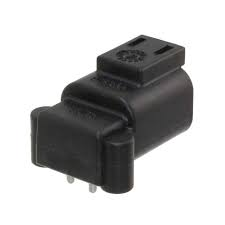
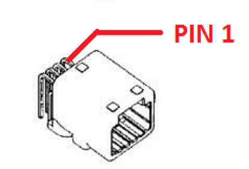
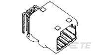

## Guide for Apollo Sensor Unit

Apollo Sensor Unit (ASU) is designed to work with Industrial PC (IPC) to implement sensor fusion, vehicle control and network access in Apollo's autonomous driving platform.

The ASU system provides sensor interfaces to collect data from various sensors, including cameras, Lidars, Radars, and Ultrasonic Sensors. The system also utilizes pulse per second (PPS) and GPRMC signals from GNSS receiver to implement data collection synchronization for the camera and LiDAR sensors. 

The communication between the ASU and the IPC is through PCI Express Interface. ASU collects sensor data and passes to IPC via PCI Express Interface, and the IPC uses the ASU to send out Vehicle Control commands in the Controller Area Network (CAN) protocol. 

In addition, Lidar connectivity via Ethernet, WWAN gateway via 4G LTE module, and WiFi access point via WiFi module will be enabled in the future releases.

### System Connectors

#### Front Panel Connectors

1. External GPS PPS / GPRMC Input Port 
2. FAKRA Camera Data Input Port (5 ports)
3. 10/100/1000M Base-T Ethernet Port (2 Ports) 
4. KL-15 (AKA Car Ignite) Signal Input Port 

#### Rear Panel Connectors 

1. Micro USB to UART port (reserved for debug) 
2. Micro USB to UART port (ASU configuration port) 
3. Micro SIM card holder for built-in LTE module 
4. General purpose UART port(reserved) 
5. USB 3.0 type A port (2 Ports)
6. External PCI Express Port (Support X4 or X8)
7. GPS PPS / GPRMC Output Port ( 3 Ports)
8. Micro USB 2.0 OTG
9. Power and PPS/GPRMC Output Port for Stereo Camera
10. CAN Bus (4 Ports)
11. Main Power Input Connector 

### Purchase Channels

The Apollo Sensor Unit is currently only provided to our Partners and certain developers. Questions regarding the availability and access to ASU should be directed to  apollo-hw@baidu.com

### Installation

1. Power Cable

   The main power is from vehicle battery, 9V ~ 36V, 120W. 

   

   |MFR|MPN|Description|
   |---------------|--------|-----------|
   |TE Connectivity|DTF13-2P|DT RECP ASM|

   | PIN # | NAME | I/O  | Description        |
   | ----- | ---- | ---- | ------------------ |
   | 1     | 12V  | PWR  | 12V (9V~36V, 120W) |
   | 2     | GND  | PWR  | GROUND             |

2. FPD-Link III cameras. 

   There are 5 FAKRA connectors for FPD Link III cameras in ASU Front Panel labeled with 1~5, respectively, from right to left. The ASU can support up to 5 cameras by enabling Camera 1 ~ 4 and 5 whose deserializers (TI, DS90UB914ATRHSTQ1) convert FPD Link III signals into parallel data signals.

   |Camera #| I2C Address | Deserializer|
   | -------- | ----------- | ------------------------- |
   | 1        | 0x60        | DS90UB914ATRHSTQ1         |
   | 2        | 0x61        | DS90UB914ATRHSTQ1         |
   | 3        | 0x62        | DS90UB914ATRHSTQ1         |
   | 4        | 0x63        | DS90UB914ATRHSTQ1         |
   | 5       | 0x64        | DS90UB914ATRHSTQ1         |

3. GPS synchronization input channel

   GPS synchronization input channel is using 1565749-1 from TE Connectivity as the connector. The connector information and the pinout are shown in the tables below.

   

   | MFR             | MPN       | Description                               |
   | :-------------- | --------- | ----------------------------------------- |
   | TE Connectivity | 1565749-1 | Automotive Connectors 025 CAP ASSY, 4 Pin |

   | PIN # | NAME  | I/O   | Description                                                  |
   | ----- | ----- | ----- | ------------------------------------------------------------ |
   | 1     | NC    | NC    | NO CIRCUIT                                                   |
   | 2     | GPRMC | INPUT | GPS Specific information contains time, date, position, track made good and speed data provided by GPS navigation receiver.  RS-232 Signal level. |
   | 3     | GND   | PWR   | GROUND (the ground for PPS and GPRMC should be shorted on ground) |
   | 4     | PPS   | INPUT | Pulse per Second from GPS transceiver, 3.3V CMOS Signal      |

4. GPS synchronization output channels

   The forwards the duplicated GPS PPS/GPRMC from external GPS to the customized 8 Pin connector. This connector provides 3 sets of PPS/GPRMC output for sensors need synchronized, such as Lidars, Stereo Cameras, etc. 

   

   |MFR| MPN| Description|
   | --------------- | --------- | ------------------------------------------------- |
   | TE Connectivity | 1376350-2 | Automotive Connectors 025 I/O CAP HSG ASSY, 8 Pin |

   | PIN # | NAME   | I/O    | Description                                             |
   | ----- | ------ | ------ | ------------------------------------------------------- |
   | 1     | GPRMC0 | OUTPUT | Channel 0, GPRMC OUTPUT, RS-232 Signal                  |
   | 2     | PPS0   | OUTPUT | Pulse per Second from GPS transceiver, 3.3V CMOS Signal |
   | 3     | GPRMC1 | OUTPUT | Channel 1, GPRMC OUTPUT, RS-232 Signal                  |
   | 4     | PPS1   | OUTPUT | Pulse per Second from GPS transceiver, 3.3V CMOS Signal |
   | 5     | GPRMC2 | OUTPUT | Channel 2, GPRMC OUTPUT, RS-232 Signal                  |
   | 6     | GND    | PWR    | GROUND                                                  |
   | 7     | GND    | PWR    | GROUND                                                  |
   | 8     | PPS2   | OUTPUT | Pulse per Second from GPS transceiver, 3.3V CMOS Signal |

5. CAN interface

   The ASU provides 4 CAN Bus ports, the datapath is :

   

   | MFR             | MPN       | Description                                        |
   | --------------- | --------- | -------------------------------------------------- |
   | TE Connectivity | 1318772-2 | Automotive Connectors 025 I/O CAP HSG ASSY, 12 Pin |

   | PIN # | NAME   | I/O   | Description     |
   | ----- | ------ | ----- | --------------- |
   | 1     | CANH-0 | INOUT | Channel 0, CANH |
   | 2     | CANL-0 | INOUT | Channel 0, CANL |
   | 3     | GND    | PWR   | Ground          |
   | 4     | CANH-1 | INOUT | Channel 1, CANH |
   | 5    | CANL-1 | INOUT | Channel 1, CANL |
   | 6    | GND    | PWR   | Ground          |
   | 7    | CANH-1 | INOUT | Channel 2, CANH |
   | 8    | CANL-1 | INOUT | Channel 2, CANL |
   | 9    | GND    | PWR   | Ground          |
   | 10   | CANH-2 | INOUT | Channel 3, CANH |
   | 11   | CANL-2 | INOUT | Channel 3, CANL |
   | 12   | GND    | PWR   | Ground          |

   
## Disclaimer

This device is `Apollo Platform Supported`