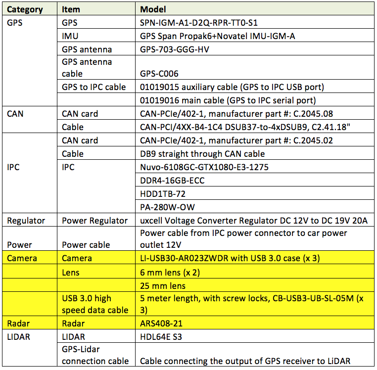
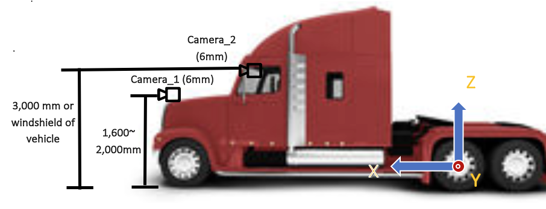
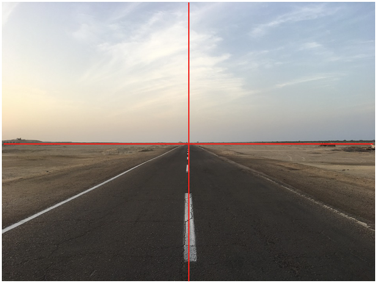

# Guideline of sensor Installation for Apollo 2.5
April 19, 2018

## Required Hardware



Peripherals


## Coordinate system

Unit: millimeter (mm)

Origin: The center of the rear wheel Axle	


**Figure 1. The origin and the coordinate of the system**


**Figure 2. Coordinates and Installation of cameras and a radar for truck**
## Sensor installation Guideline
###	IMU/GPS
IMU/GPS need to be installed near the rear wheel axle. GPS antenna needs to install at the top of the vehicle.
###	Radar
The long-range Radar needs to be installed at the front bumper of the vehicle as shown in Figure 1 and Figure 2.
###	Camera
One camera with 6mm-lens should face the front of ego-vehicle. The front-facing camera needs to be installed at the center of the front of a vehicle the height between 1,600mm and 2,000mm from the ground (Camera_1) or at the windshield of a vehicle (Camera_2).



**Figure 3. Example setup of cameras**

After installation of cameras, The physical x, y, z location of camera w.r.t. origin should be saved in the calibration file.  	

#### Verification of camera Setups
The orientation of all three cameras should be all zeros. When the camera is installed, it is required to record a rosbag by driving a straight highway. By the replay of rosbag, the camera orientation should be re-adjusted to have pitch, yaw, and roll angles to be zero degree. When the camera is correctly installed, the horizon should be at the half of image width and not tilted. The vanishing point should be also at the center of the image. Please see the image below for the ideal camera setup.



**Figure 4. An example of an image after camera installation. The horizon should be at the half of image height and not tilted. The vanishing point should be also at the center of the image. The red lines show the center of the width and the height of the image.**

The example of estimated translation parameters is shown below. 
```
header:
    seq: 0
    stamp:
        secs: 0
        nsecs: 0
    frame_id: white_mkz
child_frame_id: onsemi_obstacle
transform:
    rotation:
        x:  0.5
        y: -0.5
        z:  0.5
        w: -0.5
    translation:	
        x: 1.895
        y: -0.235
        z: 1.256 
```
If angles are not zero, they need to be calibrated and represented in quarternion (see above stransformation->rotation).
