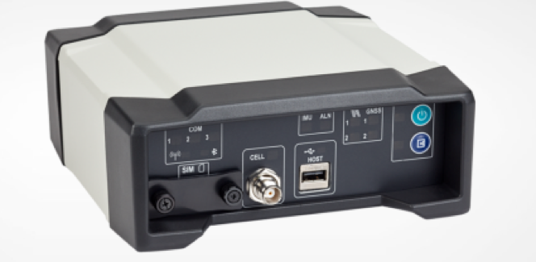

## NovAtel Propak6 和 NovAtel IMU-IGM-A1 安装指南

NovAtel ProPak6 是一个独立的GNSS接收器。它和一个单独的 NovAtel-supported IMU 协同工作提供定位功能。

IMU-IGM-A1是一个IMU（惯性计算单元）并与一个SPAN-enabled GNSS接收器例如SPAN ProPak6相互配对进行工作。



和GPS-IMU一同使用的GPS接收器/天线是 **NovAtel GPS-703-GGG-HV**。


### 安装GPS接收器和天线

本安装指令描述了挂载、连接和为 **GPS NovAtel SPAN® ProPak6™** 与 **NovAtel IMU-IGM-A1** 量取和设置控制杆尺寸的步骤

##### 安装需要的组件

在安装过程中需要的组件包括：

- NovAtel GPS SPAN ProPak6
- NovAtel IMU-IGM-A1
- NovAtel GPS-703-GGG-HV Antenna
- NovAtel GPS-C006 Cable (将天线连接到GPS)
- NovAtel 01019014 Main Cable (连接GPS到IPC上的连续接口)
- Data Transport Unit (DTU) – 和4G路由器相同
- 磁性适配器 (固定天线和DTU)
- DB9 直通网线

##### 挂载

使用者可以将装置 ProPak6 和IMU放置在车辆上的大部分位置，但是我们建议使用者采用下述的建议方案：

- 将ProPak6和IMU 并列放置并固定在车辆内部，同时使Y轴指向前方。
- 将NovAtel GPS-703-GGG-HV 天线挂载在车辆上方，或者车辆盖子的上面 ，如下图所示：


- 使用一个磁性适配器将天线牢固的固定在车辆盖子上。
- 打开车辆盖子，将天线的数据线放置在车辆盖子和车身之间的空闲区域。

##### 配线

执行如下步骤将ProPak6 GNSS接收器和IMU连接到Apollo系统：

* 使用为IMU-IGM-A1设备分配的分股数据线连接IMU Main端口和ProPak6 COM3/IMU端口。
* 使用一个USB-A-to-MicroUSB数据线连接IPC的USB端口和ProPak6的MicroUSB端口。
* 将IMU-IGM-A1分股数据线的其他端接口连接到车辆的电源系统。
* 连接GNSS天线到Propak6。
* 连接Propak6的电源线。


#### 量取控制臂长度

参考下述步骤：

* 在量取尺寸前需要启动IPC
* 当IMU和GPS天线处在正确位置时量取IMU到GPS天线的距离。IMU 的中点和天线的中点标记在设备的外部。
* 距离被测量并记录为X轴偏移、Y轴偏移和Z轴偏移。 坐标轴由IMU的位置确定。偏移量的误差应该被控制在一厘米以内以获取高精度的定位信息。

### 配置GPS和IMU

下面展现了配置GPS和IMU的方法。该配置过程可以通过键入命令或从NovAtel Connect下载批量配置文件完成。

```
WIFICONFIG STATE OFF
UNLOGALL THISPORT
CONNECTIMU COM3 IMU_ADIS16488
INSCOMMAND ENABLE
SETIMUORIENTATION 5
ALIGNMENTMODE AUTOMATIC  
VEHICLEBODYROTATION 0 0 0
COM COM1 9600 N 8 1 N OFF OFF
COM COM2 9600 N 8 1 N OFF OFF
INTERFACEMODE COM1 NOVATEL NOVATEL ON
PPSCONTROL ENABLE POSITIVE 1.0 10000
MARKCONTROL MARK1 ENABLE POSITIVE
EVENTINCONTROL MARK1 ENABLE POSITIVE 0 2
interfacemode usb2 rtcmv3 none off
rtksource auto any
psrdiffsource auto any
SETIMUTOANTOFFSET 0.00 1.10866 1.14165 0.05 0.05 0.08
SETINSOFFSET 0 0 0
EVENTOUTCONTROL MARK2 ENABLE POSITIVE 999999990 10
EVENTOUTCONTROL MARK1 ENABLE POSITIVE 500000000 500000000


LOG COM2 GPRMC ONTIME 1.0 0.25
LOG USB1 GPGGA ONTIME 1.0

log USB1 bestgnssposb ontime 1
log USB1 bestgnssvelb ontime 1
log USB1 bestposb ontime 1
log USB1 INSPVAXB ontime 1
log USB1 INSPVASB ontime 0.01
log USB1 CORRIMUDATASB ontime 0.01
log USB1 RAWIMUSXB onnew 0 0
log USB1 mark1pvab onnew

log USB1 rangeb ontime 1
log USB1 bdsephemerisb
log USB1 gpsephemb
log USB1 gloephemerisb
log USB1 bdsephemerisb ontime 15
log USB1 gpsephemb ontime 15
log USB1 gloephemerisb ontime 15

log USB1 imutoantoffsetsb once
log USB1 vehiclebodyrotationb onchanged
 
SAVECONFIG
```

** WARNING：** 基于对IMU和天线偏移值的实际测量数据修改 **<u>SETIMUTOANTOFFSET</u>** 行对应的参数

例如：

```
SETIMUTOANTOFFSET -0.05 0.5 0.8 0.05 0.05 0.08
```

前3个数字表示控制杆的测距结果。后3个数字表示测量的不确定性（误差）

### 参考资料

获取更多关于NovAtel SPAN ProPak6和IMU-IGM-A1的信息，请参考：
* [NovAtel ProPak6 Installation & Operation Manual](https://www.novatel.com/assets/Documents/Manuals/OM-20000148.pdf)
* [NovAtel IMU-IGM-A1 Product Page](https://www.novatel.com/products/span-gnss-inertial-systems/span-imus/span-mems-imus/imu-igm-a1/#overview)

* [NovAtel GPS-703-GGG-HV](https://www.novatel.com/products/gnss-antennas/high-performance-gnss-antennas/gps-703-ggg-hv/)

## 免责声明

This device is `Apollo Platform Supported`
